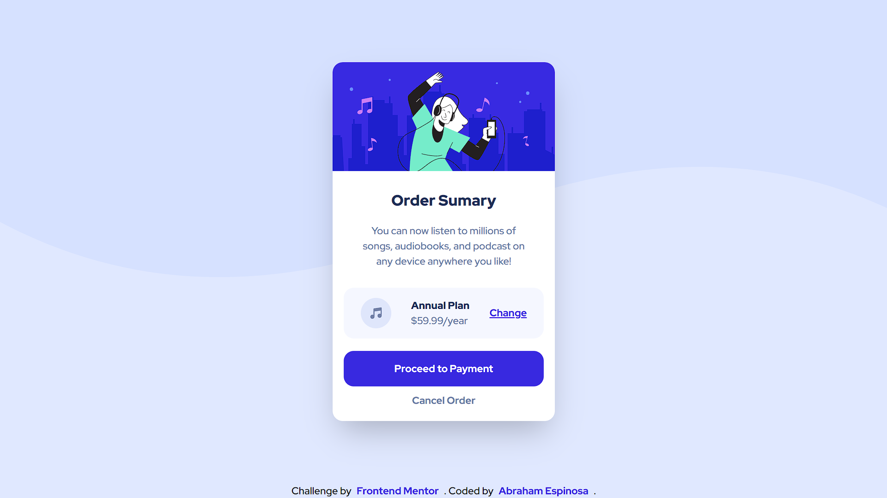

# Frontend Mentor - Order summary card solution

This is a solution to the [Order summary card challenge on Frontend Mentor](https://www.frontendmentor.io/challenges/order-summary-component-QlPmajDUj). Frontend Mentor challenges help you improve your coding skills by building realistic projects. 

## Table of contents

- [Overview](#overview)
  - [The challenge](#the-challenge)
  - [Screenshot](#screenshot)
  - [Links](#links)
  - [Built with](#built-with)
- [Author](#author)

## Overview

### The challenge

Users should be able to:

- See hover states for interactive elements

### Screenshot

### Links

- Solution URL: [Add solution URL here](https://github.com/AbrahamEspina/order-sumary-component)
- Live Site URL: [Add live site URL here](https://order-sumary-component-234.netlify.app/)

### Built with

- Astro
- Tailwindcss
- Mobile-first workflow

## Author

- Website - [Abraham Espinosa](https://abraham-portfolio-2022.netlify.app/)
- Frontend Mentor - [@AbrahamEspina](https://www.frontendmentor.io/profile/yourusername)